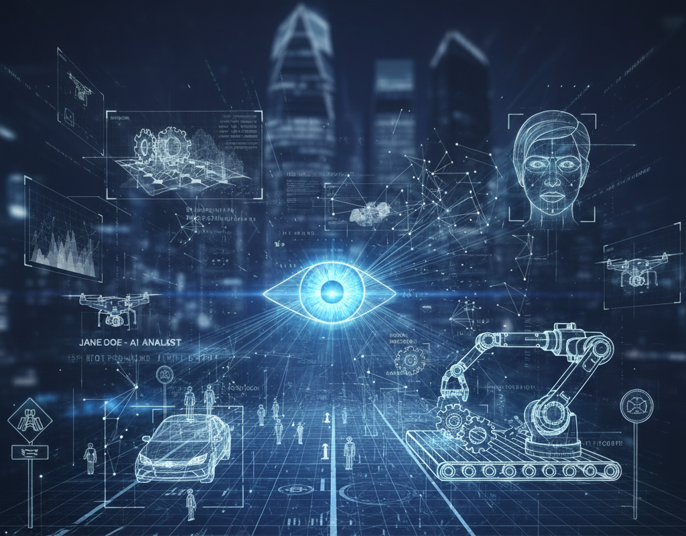

# Computer Vision in Motion
- Object Detection
- Image Segmentation
<style scoped>
h1 {
  margin-top: 25%;
}
</style>



---

# From Static to Dynamic Vision
- Evolution of Computer Vision Tasks
    - **Image Classification**: "What is in this image?"
    - **Object Detection**: "Where are the objects and what are they?"
    - **Image Segmentation**: "Which pixels belong to which objects?"

- **Key Shift**: 
    - Understanding spatial relationships and multiple objects in complex scenes

---

# Object Detection Fundamentals
- Bounding Boxes
    - Rectangular regions defining object locations
    - Formats: (x, y, width, height) or (x1, y1, x2, y2)
    - Confidence scores for each detection

- Key Challenges
    - Multiple objects at different scales
    - Real-time processing requirements
    - Occlusion and varying viewpoints

---
# YOLO: You Only Look Once

- Revolution in Real-time Detection
    - **Single-stage architecture**: 
        - Divides image into grid
        - Predicts bounding boxes and class probabilities simultaneously
        - Extremely fast inference speeds

    - **Advantages**:
        - Real-time performance (45-150 FPS)
        - Global context understanding
        - Simple pipeline

---
# Image Segmentation Types
- Three Levels of Granularity
    1. **Semantic Segmentation**: Pixel-level classification
    2. **Instance Segmentation**: Differentiates between object instances
    3. **Panoptic Segmentation**: Combines both approaches

- Ref
    - [Semantic vs Instance vs Panoptic](https://pyimagesearch.com/2022/06/29/semantic-vs-instance-vs-panoptic-segmentation/)

---
# U-Net Architecture
- Specialized for Segmentation
- **Encoder-Decoder Structure**:
    - **Encoder**: Feature extraction (contracting path)
    - **Decoder**: Precise localization (expanding path)
    - **Skip Connections**: Preserves spatial information

- **Applications**: Medical imaging, satellite imagery, autonomous driving

---
# Hands-on: Real-time Object Detection
```python
from ultralytics import YOLO
import cv2

# Load pre-trained model
model = YOLO('yolo11n.pt')

# Webcam detection
cap = cv2.VideoCapture(0)
while True:
    ret, frame = cap.read()
    results = model(frame)
    annotated_frame = results[0].plot()
    cv2.imshow('YOLO Detection', annotated_frame)
```
---
# Hands-on: Image Segmentation
```python
from ultralytics import YOLO

# Load segmentation model
model = YOLO('yolo11n-seg.pt')

# Perform segmentation
results = model('street_scene.jpg')
results[0].show()  # Display with masks
```

---
# Performance Comparision
Task|	Output|	Speed|	Use Cases
----|---------|------|------------
Classification|	Single label|	Fastest|	Content filtering, basic recognition
Object Detection|	Bounding boxes + labels|	Fast|	Surveillance, retail analytics
Segmentation|	Pixel-level masks|	Slowest|	Medical imaging, autonomous driving

---
# Real World Applications
- Autonomous Vehicles
    - Lane detection (segmentation)
    - Pedestrian and vehicle detection
    - Traffic sign recognition

- Medical Imaging
    - Tumor segmentation in MRI/CT scans
    - Cell counting in microscopy
    - Organ segmentation for surgery planning

- Retail & E-commerce
    - Shelf monitoring and inventory management
    - Virtual try-on applications
    - Customer behavior analysis

- Agriculture
    - Crop health monitoring
    - Yield prediction through segmentation
    - Pest detection

---
# Technical Considerations
- Challenges in Real-time Applications
    - Computational Constraints: Balancing accuracy vs. speed
    - Lighting Variations: Robustness to different conditions
    - Scale Variations: Detecting objects at multiple distances
    - Occlusion Handling: Partial object visibility

---
# Model Selection Guide
- When to Use Which Approach?
    - YOLO: Real-time applications, multiple object detection
    - U-Net: Precision tasks, medical imaging, detailed segmentation
    - Mask R-CNN: Instance segmentation with high accuracy
    - Detectron2: Research applications, customizable pipelines

---
# Ethical Considerations
- Important Discussion Points
    - Privacy: Surveillance and facial recognition
    - Bias: Training data representation
    - Safety: Autonomous systems responsibility
    - Transparency: Explainable AI decisions

---
# Getting Started Resources
- Recommended Tools & Libraries
    - Ultralytics YOLO: Easy-to-use object detection
    - Detectron2: Facebook's segmentation platform
    - OpenCV: Computer vision operations
    - Roboflow: Dataset management and augmentation
---

# Next Steps
- Experiment with different model sizes (nano, small, medium, large)
- Try custom training on specific datasets
- Explore model optimization for deployment

---
# References
Technology/Concept|	Resource Type & Link|	Key Details / Purpose
------------------|---------------------|--------------------------
YOLO (All Versions)|	[A Comprehensive Review of YOLO...](https://arxiv.org/html/2304.00501v6/)	|Covers evolution from YOLOv1 to YOLOv8 and YOLO-NAS; includes metrics, architecture changes, and diverse applications.
U-Net| [U-Net: Convolutional Networks for Biomedical Image Segmentation](https://arxiv.org/abs/1505.04597)	|Introduces the classic encoder-decoder architecture with skip connections for precise image segmentation.
Mask R-CNN| [Mask R-CNN](https://arxiv.org/abs/1703.06870)	|Extends Faster R-CNN by adding a parallel branch for predicting high-quality segmentation masks for each object instance.
Detectron2| [Official Documentation: Detectron2 Docs](https://detectron2.readthedocs.io/)	|Meta AI's framework for object detection and segmentation, built on PyTorch. Source for models and training code.
OpenCV| [Main Documentation: OpenCV Docs](https://docs.opencv.org/4.x/index.html)|	The fundamental library for computer vision tasks, essential for image/video I/O, preprocessing, and GUI operations.
  | [Python Tutorials: OpenCV-Python Tutorials](https://docs.opencv.org/4.x/d6/d00/tutorial_py_root.html)|	Practical guides for using OpenCV with Python, ideal for hands-on components and getting started.
Roboflow| [Platform & Learning: Roboflow Docs](https://docs.roboflow.com/)|	End-to-end platform for building computer vision projects (managing datasets, training, and deployment).
 | [Learning Resources: Roboflow Learn](https://roboflow.com/learn)|	Educational guides and tutorials covering computer vision fundamentals and project workflows.
COCO Dataset| Evaluation Metrics|	A common benchmark dataset. Its evaluation metric, Average Precision (AP), is standard for object detection models.