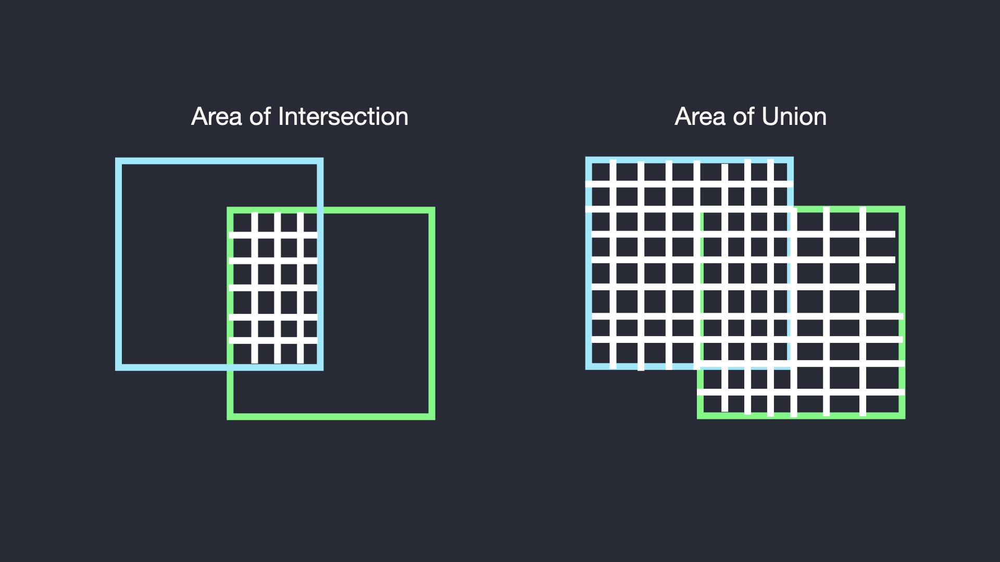
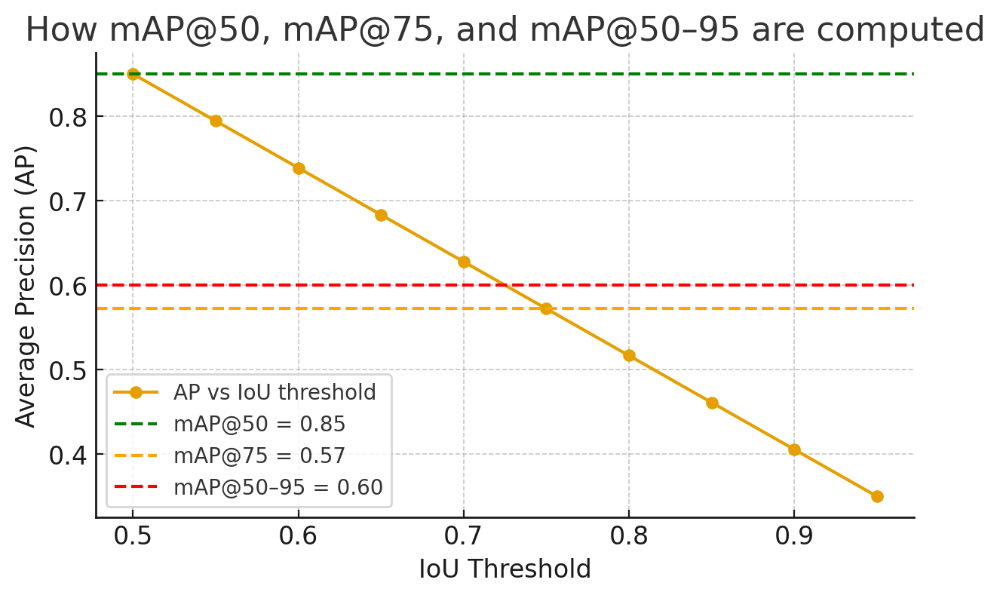

# <br><br><br>Computer Vision in Motion


---
# <br><br><br>Fundamentals Concepts


---
# From Static to Dynamic Vision
- Evolution of Computer Vision Tasks
    - **Image Classification**: "What is in this image?"
    - **Object Detection**: "Where are the objects and what are they?"
    - **Image Segmentation**: "Which pixels belong to which objects?"

- **Key Shift**: 
    - Understanding spatial relationships and multiple objects in complex scenes

---

# Object Detection Fundamentals
- **Bounding Boxes**
    - Rectangular regions defining object locations
    - Formats: (x, y, width, height) or (x1, y1, x2, y2)
    - Confidence scores for each detection

- Key Challenges
    - Multiple objects at different scales
    - Real-time processing requirements
    - Occlusion and varying viewpoints

---
# Image Segmentation Types
<div class="columns">
<div>

- Semantic Segmentation


- Instance Segmentation


- Panoptic Segmentation

</div>
<div>

- **Semantic** and **Instance** segmentation
    - mature and widely used
- **Panoptic** segmentation
    - newer and growly rapidly for comprehensive scene understanding


> image from https://pyimagesearch.com/
</div>
</div>


---
# Performance Comparision
Task|	Output|	Speed|	Use Cases
----|---------|------|------------
Classification|	Single label|	Fastest|	Content filtering, basic recognition
Object Detection|	Bounding boxes with labels|	Fast|	Surveillance, retail analytics
Segmentation|	Pixel-level masks|	Slowest|	Medical imaging, autonomous driving

---
# Technical Considerations
- Challenges in Real-time Applications
    - Computational Constraints: Balancing accuracy vs. speed
    - Lighting Variations: Robustness to different conditions
    - Scale Variations: Detecting objects at multiple distances
    - Occlusion Handling: Partial object visibility

---
# <br><br><br>Computer Vision Metrics


---
# Intersection over Union (IoU)
<div class="columns">
<div>

$$
IoU = \frac{\text{Area of Overlap}}{\text{Area of Union}}
$$

- measures how close one prediction box is to the real box
    - 100%: perfect match
    - &nbsp; &nbsp; 0%: no match

</div>
<div>


</div>
</div>

---
# Average Precision (AP)

<div class="columns">
<div>

$$
AP = \text{Area under Precision-Recall curve}
$$
- measures how well model classifies overall
    - not just the one box
- combines 2 ideas
    - **Precision**: of all predicted
        - how many were correct ?
    - **Recall**: of all the actual
        - how many did the model find ?

</div>
<div>


</div>
</div>

<!--
AP=1.0 (perfect) - curves stay at top at all recall levels
AP=0.5 (average) - precision drops as recall increases (some missed detections or false positives)
AP=0 (poor) - model fails to detect anything 
-->


---

# Mean Average Precision (mAP)

<div class="columns">
<div>

- Mean AP values for all classes
    - eg. 3 classes (cat, dog, car)
        $$
        mAP = \frac{AP_{cat} + AP_{dog} + AP_{car}}{3}
        $$

- mAP@50-95
    - more strict and modern standard 
        - based on COCO benchmark
    - AP at 10 IoU thresholds
        - 0.50,0.55 ... 0.90,0.95
</div>
<div>



</div>
</div>

<!--
Here’s a simple visualization showing how AP changes with IoU thresholds:
- mAP@50 → the AP when IoU = 0.5 (lenient match).
- mAP@75 → the AP when IoU = 0.75 (stricter match).
- mAP@50–95 → the average AP across all thresholds from 0.5 to 0.95 (step 0.05), giving a more balanced view of detection quality across easy and hard cases.
-->

---

# <br><br><br>Computer Vision Models


---
# YOLO: You Only Look Once

- Revolution in Real-time Detection
    - **Single-stage architecture**: 
        - Divides image into grid
        - Predicts bounding boxes and class probabilities simultaneously
        - Extremely fast inference speeds

    - **Advantages**:
        - Real-time performance (45-150 FPS)
        - Global context understanding
        - Simple pipeline

---
# Demo - YOLO
- [Yolo with livestream video](https://githubtocolab.com/JasonL888/AI_Experiments/blob/main/ComputerVisionInMotion/yolo_livestream.ipynb)

```python
from ultralytics import YOLO
import cv2

# Load pre-trained model
model = YOLO('yolo11n.pt')

# Webcam detection
cap = cv2.VideoCapture(0)
while True:
    ret, frame = cap.read()
    results = model(frame)
    annotated_frame = results[0].plot()
    cv2.imshow('YOLO Detection', annotated_frame)                                                 
```

---

# <br><br><br>References


---
# References
- [Semantic vs Instance vs Panoptic Segmentation](https://pyimagesearch.com/2022/06/29/semantic-vs-instance-vs-panoptic-segmentation/)
- [A Comprehensive Review of YOLO...](https://arxiv.org/html/2304.00501v6/)
- [OpenCV Docs](https://docs.opencv.org/4.x/index.html)