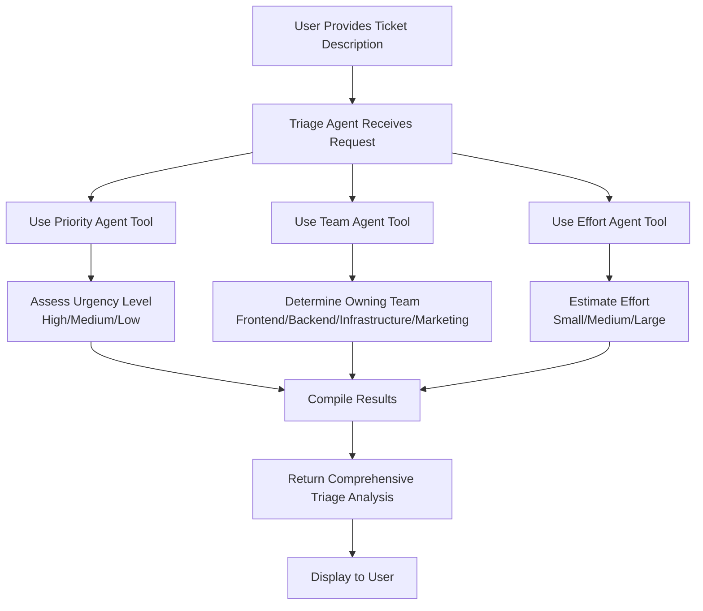
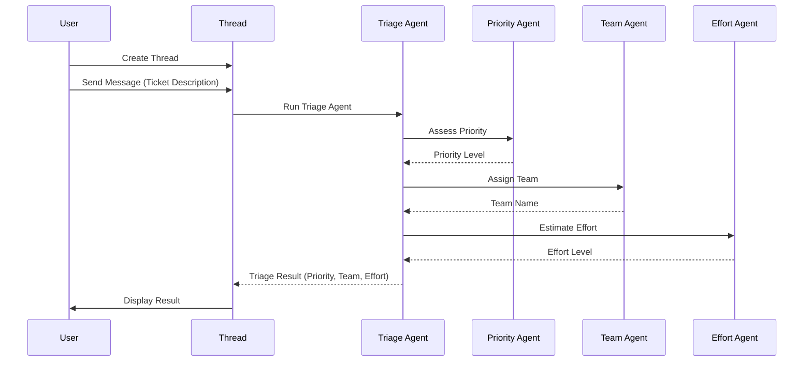

# Miscellaneous Notes

## Deep Dive into "Develop a multi-agent solution"
### High-Level Design
At high-level, the flow is as follows
- `Triage Agent` 
    - receives the ticket
    - uses other agents as tools
        - `Priority Agent` to determine urgency
        - `Team Agent` to determine issue owner
        - `Effort Agent` to estimate effort
    - compiles result



- Interactions as shown in sequence diagram


### Low-Level Design
- `Triage Agent` initialized with following prompt
    ```text
    Triage the given ticket. Use the connected tools to determine the ticket's priority,which team it should be assigned to, and how much effort it may take.  
    ```

- Tools agents 
    - initialized with following prompts
        - `Priority Agent`
            ```text
            Assess how urgent a ticket is based on its description.

            Respond with one of the following levels:
            - High: User-facing or blocking issues
            - Medium: Time-sensitive but not breaking anything
            - Low: Cosmetic or non-urgent tasks

            Only output the urgency level and a very brief explanation.
            ```
        - `Team Agent`
            ```text
            Decide which team should own each ticket.

            Choose from the following teams:
            - Frontend
            - Backend
            - Infrastructure
            - Marketing

            Base your answer on the content of the ticket. Respond with the team name and a very brief explanation.
            ```
        - `Effort Agent`
            ```text
            Estimate how much work each ticket will require.

            Use the following scale:
            - Small: Can be completed in a day
            - Medium: 2-3 days of work
            - Large: Multi-day or cross-team effort

            Base your estimate on the complexity implied by the ticket. Respond with the effort level and a brief justification.
            ```
    - Abstracted as ConnectedAgentTool
        ```python
        # Create connected agent tools for the support agents
        priority_agent_tool = ConnectedAgentTool(
            id=priority_agent.id,
            name=priority_agent_name,
            description="Assess the priority of a ticket"
        )

        team_agent_tool = ConnectedAgentTool(
            id=team_agent.id,
            name=team_agent_name,
            description="Determines which team should take the ticket"
        )

        effort_agent_tool = ConnectedAgentTool(
            id=effort_agent.id,
            name=effort_agent_name,
            description="Determines the effort required to complete the ticket"
        )
        ```

- `Triage Agent` - uses the other agents as tools
    ```python
        triage_agent = agents_client.create_agent(
            model=model_deployment,
            name=triage_agent_name,
            instructions=triage_agent_instructions,
            tools=[
                priority_agent_tool.definitions[0],
                team_agent_tool.definitions[0],
                effort_agent_tool.definitions[0]
            ]
        )
    ```

### Credits
- Microsoft for providing 
    - [Lab instructions for "Develop a multi-agent solution" ](https://microsoftlearning.github.io/mslearn-ai-agents/Instructions/03b-build-multi-agent-solution.html)
    - [Sample code - with placehoders per Lab instructions](https://github.com/MicrosoftLearning/mslearn-ai-agents/tree/main/Labfiles/03b-build-multi-agent-solution/Python)

