# <br><br>Multi-Step<br>AI Agent
- Intelligent systems that plan and execute


---
# Evolution from Single-Task to Multi-Step AI

- Logical Conclusion
    - Moving beyond single-task models
    - Creating AI systems that plan and execute complex workflows
    - Autonomous task decomposition and execution
        - **next frontier in AI capability**
---
# Key Concepts: Core Building Blocks

- **AI Agents**
    - autonomous systems that perceive, reason and act
- **Reasoning**
    - chain-of-thought, planning, decision-making
- **Tool Use**
    - APIs, calculators, code execution, external services
- **ReAct Paradigm**
    - Reason  <i class="fas fa-arrow-alt-circle-right"></i> Act <i class="fas fa-arrow-alt-circle-right"></i>  Observe loops
- **Agentic Loops**
    - continuous perception-action cycles

---
# ReAct Paradigm in Action
```
Thought: I need to solve this problem...                                     
Action: Use [calculator] for computation
Observation: Result is 42
Thought: Now I should...
Action: Call [API] to get weather data
Observation: Temperature is 25°C
Thought: Based on this, I'll...
```
- Continuous reasoning and action cycles

---
# Model Context Protocol (MCP)
<div class="columns">
<div>

- What is MCP?
    - **Standardized protocol** for AI agent tool integration
    - **Universal connector** between agents and tools/resources
    - **Type-safe** tool definitions and responses
    - **Secure** resource access control
</div>
<div>


</div>
</div>


---

# Model Context Protocol (MCP)
<div class="columns">
<div>

- Key Benefits
    - **Interoperability**: Works across different agent frameworks
    - **Security**: Fine-grained access controls
    - **Modularity**: Plug-and-play tool ecosystem
    - **Observability**: Standardized monitoring and logging
</div>
<div>


</div>
</div>


---
# Hands-On
<div class="columns">
<div>

- [Develop a multi-agent solution with Azure AI Foundry](https://microsoftlearning.github.io/mslearn-ai-agents/Instructions/03b-build-multi-agent-solution.html)
</div>
<div>


</div>
</div>


---
# Critical Discussion: Benefits vs Risks

<div class="columns">
<div>

- Potential Benefits 
    - **Efficiency**: Automate complex multi-step processes
    - **Scalability**: Handle tasks beyond human bandwidth
    - **Consistency**: Reliable execution of repetitive workflows
    - **Innovation**: Solve problems requiring multiple capabilities
</div>
<div>

- Potential Risks
    - **Alignment**: Goals NOT match human intentions
    - **Safety**: Harmful actions
    - **Control**: No oversight and intervention capability
    - **Transparency**: No visibility on agent decision-making
</div>
</div>

---
# The Alignment Challenge - how we ensure ?
<div class="columns">
<div>

- **Technical Approaches:**
    - Constrained action spaces
    - Reward modeling and shaping
    - Verification and validation systems
    - Human-in-the-loop oversight
</div>
<div>

- **Ethical Frameworks:**
    - Value alignment principles
    - Fail-safe mechanisms
    - Audit trails and monitoring
    - Graduated autonomy levels
</div>
</div>

---

# Architecture Patterns for Safe Agents

- Building Responsible AI Systems
    - **Circuit Breakers**: Automatic shutdown triggers
    - **Approval Gates**: Human review checkpoints
    - **Scope Limitation**: Domain-specific boundaries
    - **Monitoring**: Real-time performance tracking
    - **Rollback**: Safe recovery mechanisms

---

# Looking Forward: The Agentic Future

- Key Takeaways
    - Multi-step agents represent the next evolution in AI
    - Tool use and reasoning enable complex problem-solving
    - Safety and alignment are critical design considerations
    - Hands-on experience builds essential skills

- The future isn't just AI
    - it's agentic AI systems **working alongside humans**


