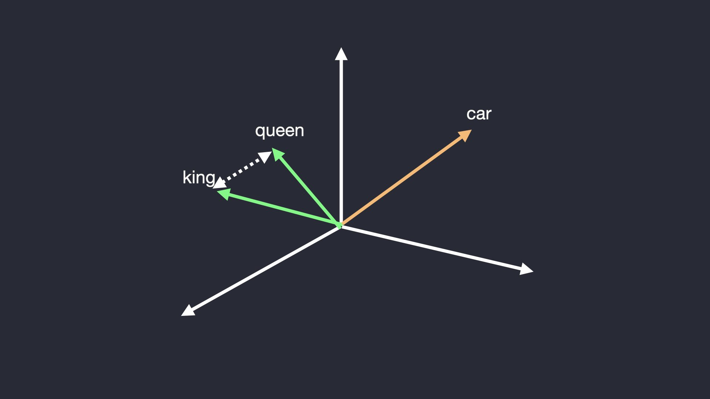

# <br><br>Custom<br>RAG System
- Tackling LLM Hallucination


---
# Problem: LLM Hallucination

* **What is it?** 
    - LLMs confidently generate incorrect or fabricated information.
* **Why does it happen?** 
    - LLMs are trained to predict the next most likely token
        - not to be factually correct databases.
* **Core Issue:** 
    - An LLM's knowledge is frozen at its training date
        - it cannot access your private data.
---
# Solution: Retrieval-Augmented Generation
<div class="columns">
<div>

- Framework for 
    - **augmenting** LLM **prompts** with 
        - relevant, contextual information 
            - from external knowledge base
</div>
<div>


</div>
</div>

---
# Key Concept: Vector Embeddings

<div class="columns">
<div>

- **What are they?** 
    - Numerical representations of text that capture its semantic meaning.
- **How do they work?** 
    - Similar concepts and phrases are located close together in the vector space.

</div>
<div>

-  Example:
    - The vectors for "king" and "queen" are closer to each other than to the vector for "car."


</div>
</div>


---

# Key Concept: Vector Databases

- **Purpose:** 
    - Specialized databases designed to store and efficiently search through vector embeddings
- **Problem they solve:** 
    - `Find the top K vectors most similar to this query vector`
- **Perfect for RAG:** 
    - They find the most semantically relevant text chunks for a user's question.
- Examples: 
    - ChromaDB, FAISS, Pinecone, Weaviate.

---

# RAG Pipeline: A Step-by-Step Guide
- Preparation
    1.  **Ingest & Chunk**
    2.  Generate **Embeddings**
    3.  Store in **Vector DB**
- Upon query
    4.  **Retrieve**  
    5.  **Synthesize & Answer**

---
# Step 1: Ingest & Chunk

- Goal:
    - **Break down** your source document (PDF, TXT, etc.) into manageable pieces.
- Why chunk? 
    - LLMs have limited **context windows**. We can't feed an entire 100-page PDF.
- Challenge:
    -  Bad chunking is a major failure mode!
        - Too small: Lose context and meaning.
        - Too large: Introduce irrelevant noise for the LLM.
- Common Strategy: 
    - Use **overlapping chunks** of ~500-1000 characters.

---

# Step 2: Generate Embeddings

- Process: 
    - Run each text chunk through an **embedding model**
- Options:
    - OpenAI's `text-embedding-ada-002` (Simple, effective, paid)
    - Open-source (e.g., `sentence-transformers`) (Free, run locally)
- Output:
    - A **high-dimensional vector** for each chunk, stored for later.
---

# Step 3: Store in Vector DB

- Process: 
    - Take the **generated vectors** and their **corresponding text chunks** 
    - Load them into your **vector database** (e.g., ChromaDB/FAISS)
- This creates your **external knowledge base**
    - The system is now "ready" to answer questions.

---

# Step 4: Retrieve

1.  A user asks a question: "What was the company's revenue in Q4?"
2.  The system generates an embedding **for the query**.
3.  The vector DB performs a **semantic search** to find the top K (e.g., 3-5) text chunks whose vectors are most similar to the query vector.

---

# Step 5: Synthesize & Answer
- Construct the **"Grounded" Prompt**:
    ```text
    Use the following context to answer the user's question. If you don't know the answer, just say so.                

    Context:
    {Retrieved_Chunk_1}
    {Retrieved_Chunk_2}

    User Question: {User's_Original_Question}

    text
    ```
- Feed this prompt to the LLM
    - LLM now generates an answer **based on the provided context**
        - drastically reducing hallucinations.

---
# How Does This Improve Over a Raw LLM?
- **Factual Grounding**: 
    - Drastically reduces hallucinations by tethering answers to a source.
- **Up-to-Date Information**: 
    - Knowledge base can be updated independently of the LLM.
- **Domain Specialization**: 
    - Can answer questions about private, proprietary, or niche data.
- **Transparency** & Citations: 
    - You can trace the answer back to the source chunks.

---

# What Are the Failure Modes?
- **Bad Chunking**: 
    - Chunks that are too small lose context; too large introduce noise.
- **Missing** Information: 
    - If answer is NOT in database, the LLM might guess (hallucinate) or correctly state it doesn't know.
- **Poor Retrieval**: 
    - The vector search didn't find the most relevant chunks.
        - Could be due to a weak embedding model or a query that is phrased very differently from the source text.
- **Synthesis Failure**: 
    - LLM might ignore the context or misrepresent it, even with good retrieval.
---
# Demo
- [RAG agent - python notebook](https://githubtocolab.com/JasonL888/AI_Experiments/blob/main/RAG_Agent/rag_agent.ipynb)


---

# Key Takeaways
- RAG is a **powerful, foundational pattern** 
    - for building grounded and useful LLM applications
- It directly addresses the critical problem of **LLM hallucination**.
- core technologies are 
    - **vector embeddings** and **vector databases**
- Success depends on the entire pipeline: 
    `Chunking -> Embedding -> Retrieval -> Synthesis`


