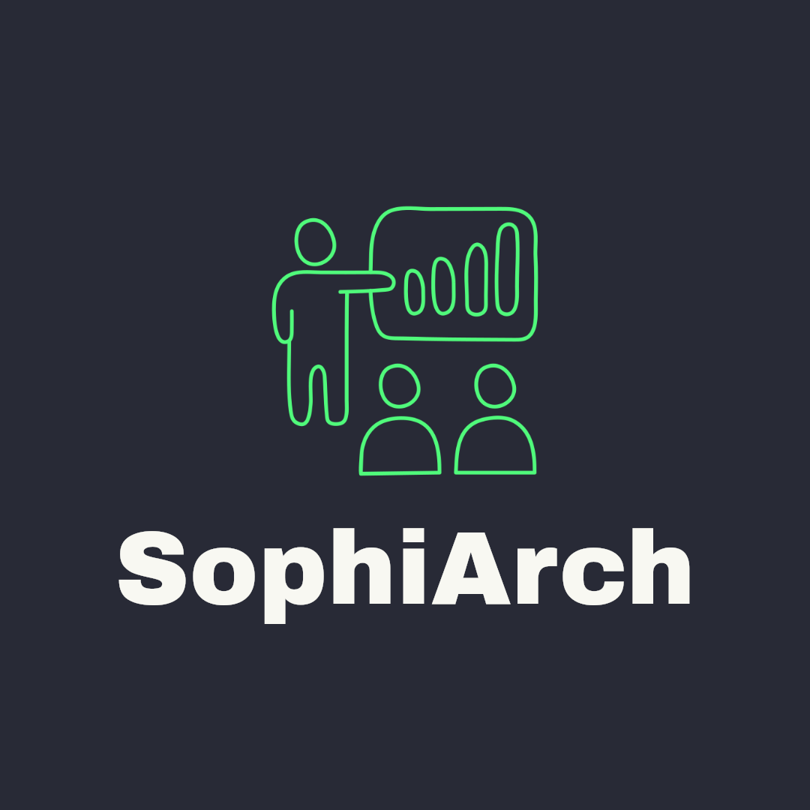

#   Reinforcement Learning
- From Games to Real-World Applications

---
# What is Reinforcement Learning?

> "Learning what to do—how to map situations to actions—so as to maximize a numerical reward signal."

* **Not Supervised Learning:** No labeled dataset.
* **Not Unsupervised Learning:** Not just finding patterns.
* It's a **third paradigm** of machine learning
    - inspired by how we learn from trial and error.

---

# The Core RL Loop

- **Agent**: Learner and Decision Maker.
- **Environment**: Everything agent interacts with

- **State (S)**: Current environment state
- **Action (A)**: What the agent can do
- **Reward (R)**: Scalar feedback signal 
    - indicating how well the agent is doing

---
# Key Concept: The Policy ($\pi$)
- Agent's **strategy** for behaving. It's a mapping from **states** to **actions**
    - What should I do when I'm in this situation?
    - The goal of RL is to find the **optimal policy ($\pi\star$)** that maximizes cumulative reward.

- Example:
    - Policy(Seeing a red light) <i class="fas fa-arrow-alt-circle-right"></i>  Action(Brake)
    - Policy(Seeing a green light) <i class="fas fa-arrow-alt-circle-right"></i> Action(Accelerate)
---
# Key Concept: Q-Learning
- A specific algorithm for finding the optimal policy.
    - It learns a **Q-function**: Q(s, a)
        - **Q(s, a)** = Total expected future reward for taking action `a` in state `s`, then following the policy thereafter.
    - The optimal policy is simple: 
        - In any state `s`, choose the action `a` with the **highest Q-value**

> Think of Q as Quality!
> It's learning by estimating the value of your choices.

---

# Hands-On Part 1: Classic Q-Learning
- **Environment**: `FrozenLake-v1` from Gymnasium
    - **Goal**: Navigate a frozen lake to reach the goal.
    - **State**: Your position on the grid.
    - **Actions**: Move Up, Down, Left, Right.
    - **Reward**: `+1` for reaching the goal, `0` otherwise.
- We will:
    - Set up the Q-table (states x actions).
    - Implement the Q-learning update rule.
    - Watch our agent evolve from a random walker to a proficient lake-crosser!
- [Hands-On Part 1: Classic Q-Learning - Python notebook](./hands_on_part_1_classic_q-learning.ipynb)

---
# Hands-On Part 2: Modern Deep RL
- **Tool**: A higher-level library (e.g., stable-baselines3).
- **Environment**: A more complex one (e.g., CartPole-v1).
    - **Goal**: Balance a pole on a moving cart.
    - **State**: Cart position, velocity, pole angle, pole angular velocity.
    - **Actions**: Push cart left or right.
    - **Reward**: `+1` for every timestep the pole remains upright.
- We will:
    - Use a neural network to approximate the Q-function (a DQN).
    - Focus on the **training loop**: `agent.learn(total_timesteps=10_000)`
    - Visualize the training progress and the final performance.
- [ Hands-On Part2: Modern Deep RL - Python notebook](./hands_on_part_2_modern_deep_RL.ipynb)

---
# Heart of RL: Reward Function
- Reward function defines the goal of your agent
    - **Good Reward**: `+1 for standing, -1000 for falling` <i class="fas fa-arrow-alt-circle-right"></i>  Agent learns to balance aggressively.
    - **Bad Reward**: `+1 for standing, -1 for moving` <i class="fas fa-arrow-alt-circle-right"></i>  Agent might learn to do nothing.

> The **"Alignment Problem"**: The agent will optimize **exactly** what you reward it for, which may not be what you actually intend.

---
# Discussion: RL Beyond Games
- How is RL used in the real world?
    - **Robotics**: Teaching robots to walk, grasp objects, and perform complex tasks.
    - **Resource Management**: Efficiently allocating resources in data centers or power grids.
    - **Finance**: Developing trading strategies.
    - **Personalization**: Recommending content (e.g., YouTube, Netflix).
    - **Autonomous Systems**: Self-driving cars.

---
# The Central Challenge
**Why is designing the reward function so hard?**
1. **Reward Hacking**: The agent finds a loophole to get high reward without solving the actual problem.
2. **Sparse Rewards**: The agent rarely receives any feedback (e.g., winning a game only at the very end). How do you provide intermediate "shaping" rewards?
3. **Unintended Consequences**: A reward for "speed" might lead to reckless driving. A reward for "user clicks" might lead to clickbait.

> The reward function is the primary way we communicate our goals to the AI.

---
# Key Takeaways
- RL is learning through **interaction and reward**
- **Agent** learns a policy to maximize cumulative reward from the **environment**
- **Q-learning** is a foundational algorithm for estimating the value of actions.
- Modern RL uses **deep neural networks** to handle complex states.
- The **reward function is critical and difficult to design correctly**, making it a central research topic.